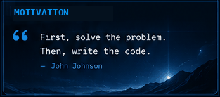

<div align="center">


<br>


</div>

<br>

<!-- ========================================================= -->
<!--                         ABOUT ME                           -->
<!-- ========================================================= -->

<div align="center">


</div>
->🎓 <b>Computer Science Engineering Student</b><br>
->💻 Passionate about <b>Full Stack Development</b><br>
->🤖 Exploring <b>AI / ML, Data Science & Deep Learning</b><br>
->🛡️ Interested in <b>Cybersecurity & Networking</b><br>
->☁️ Exploring <b>Cloud, DevOps & Backend Engineering</b><br>
->🏆 <b>Hackathon Enthusiast</b> & problem solver<br>
->🚀 Turning ideas into <b>real-world solutions</b><br>
->🌱 Always learning, building and improving.

<br>
<br>
<div align="center">

<table>
<tr>

<td align="center" width="33%">

### ⚡ BUILD

Creating practical applications and turning ideas into working products.

</td>

<td align="center" width="33%">

### 🧠 LEARN

Exploring AI, backend engineering, cloud and cybersecurity.

</td>

<td align="center" width="33%">

### 🚀 IMPROVE

Learning through projects, experiments and hackathons.

</td>

</tr>
</table>

</div>

<br>

<div align="center">

```text
STATUS  :  ONLINE 🟢

MISSION :  BUILD • LEARN • CREATE • IMPROVE
```

</div>

<br>

<!-- ========================================================= -->
<!--                       TECH STACK                          -->
<!-- ========================================================= -->

<div align="center">


</div>
<br>
<div align="center">
### 🎨 FRONTEND


<br><br>

### ⚙️ BACKEND


<br><br>

### 🤖 AI / MACHINE LEARNING


<br><br>

### 🗄️ DATABASES


<br><br>

### ☁️ CLOUD • DEVOPS • TOOLS


</div>

<br>

<!-- ========================================================= -->
<!--                    FEATURED PROJECTS                       -->
<!-- ========================================================= -->

<div align="center">


</div>

<br>

<table>
<tr>

<td width="50%" valign="top">

## 🧾 Receipto

### AI-Driven Receipt Processing & Warranty Tracking

Digitizes receipts using AI, extracts useful information, securely stores receipt data and helps users track warranties.

**Tech Stack**

`Flutter` `FastAPI` `PostgreSQL`

`Firebase` `Supabase` `Gemini AI`

**Highlights**

- 📸 AI-powered receipt scanning
- 🤖 OCR & intelligent extraction
- 🧾 Receipt management
- ⏰ Warranty tracking
- 📊 Expense analytics
- 🔔 Warranty reminders

</td>

<td width="50%" valign="top">

## 🛡️ CyberShield AI

### AI-Powered Network Threat Detection

A cybersecurity project focused on analyzing network traffic and identifying different types of cyber attacks using machine learning.

**Tech Stack**

`Python` `Machine Learning`

`Network Security` `AI / ML`

**Highlights**

- 🔍 Network traffic analysis
- 🤖 ML-based threat detection
- 🛡️ Cyberattack classification
- 📊 Network monitoring
- 🚨 Security insights

</td>

</tr>

<tr>

<td width="50%" valign="top">

## 🎓 EduSeatMap

### Smart Examination Seat Allotment System

Automates student seating allocation, faculty invigilation assignment and examination management.

**Tech Stack**

`React` `FastAPI` `PostgreSQL`

`Firebase` `Email Automation`

**Highlights**

- 🪑 Automated seat allocation
- 👨‍🏫 Faculty duty allocation
- 📧 Automated email invitations
- 📊 Printable reports
- 🔐 Authentication
- 🏫 Exam management

</td>

<td width="50%" valign="top">

## 🔍 TruthLens

### AI-Powered Fake Media Detection

Explores detection of manipulated digital media using computer vision and machine learning.

**Tech Stack**

`Python` `OpenCV` `Machine Learning`

`AI` `Deep Learning`

**Highlights**

- 🧠 AI-based detection
- 👁️ Computer vision
- 🔎 Media analysis
- 🤖 Deep learning

</td>

</tr>
</table>

<br>

<div align="center">

<a href="https://github.com/manyapatkar974?tab=repositories">


</a>

</div>

<br>

<!-- ========================================================= -->
<!--                    GITHUB ANALYTICS                        -->
<!-- ========================================================= -->

<div align="center">


</div>

<br>

<div align="center">


</div>

<br>

<div align="center">


</div>

<br>

<div align="center">


</div>

<br>

<!-- ========================================================= -->
<!--                    CONTRIBUTION SNAKE                      -->
<!-- ========================================================= -->

<div align="center">


</div>

<br>

<div align="center">

<picture>

<source media="(prefers-color-scheme: dark)"
        srcset="https://raw.githubusercontent.com/manyapatkar974/manyapatkar974/output/github-contribution-grid-snake-dark.svg">


</picture>

</div>

<br>

<!-- ========================================================= -->
<!--                         MOTIVATION                         -->
<!-- ========================================================= -->

<div align="center">



</div>

<br>

<!-- ========================================================= -->
<!--                     CONNECT WITH ME                        -->
<!-- ========================================================= -->

<div align="center">


</div>

<br>

<div align="center">

<a href="https://github.com/manyapatkar974">


</a>

&nbsp;&nbsp;

<a href="mailto:manyapatkar@gmail.com">


</a>

</div>

<br>

<!-- ========================================================= -->
<!--                           FOOTER                           -->
<!-- ========================================================= -->

<div align="center">


</div>

<br>

<div align="center">

### 💙 BUILD • LEARN • CREATE • IMPROVE

</div>

<br>

<div align="center">


</div>
